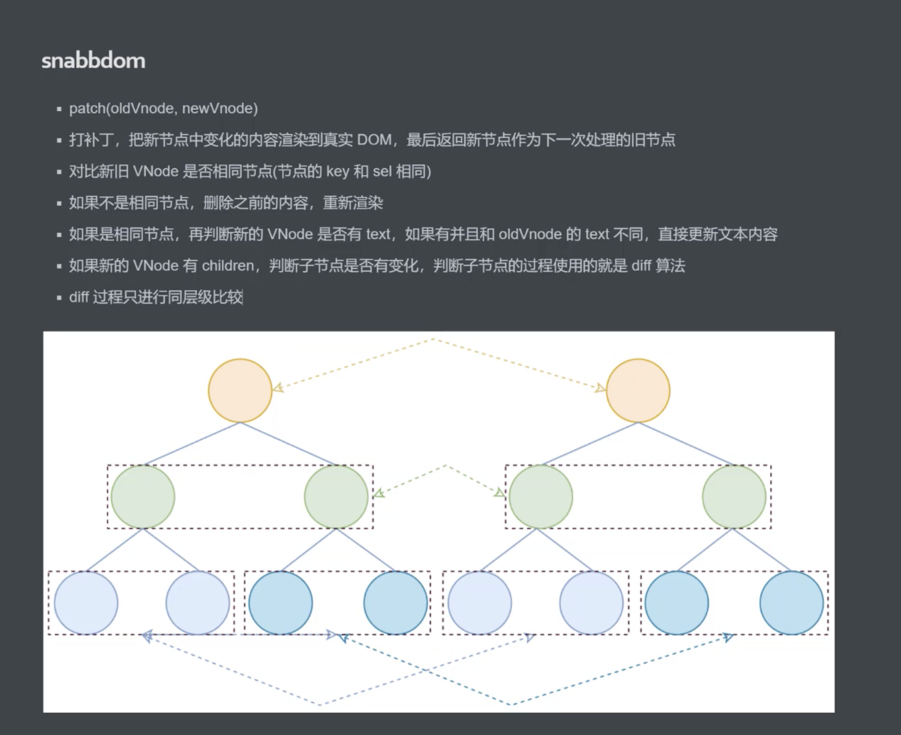
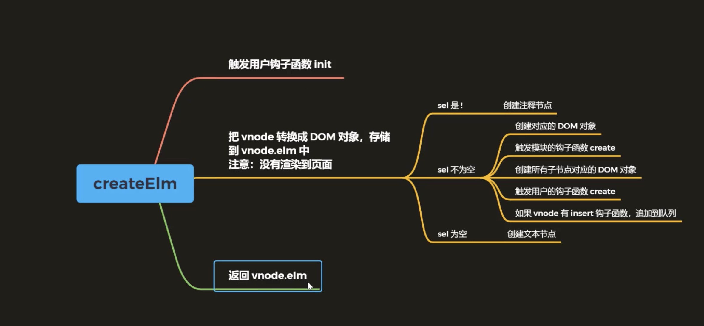
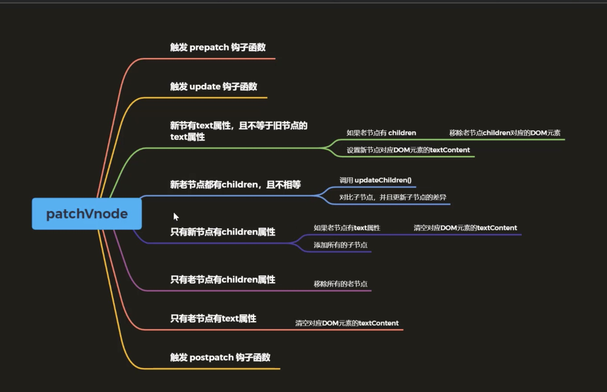
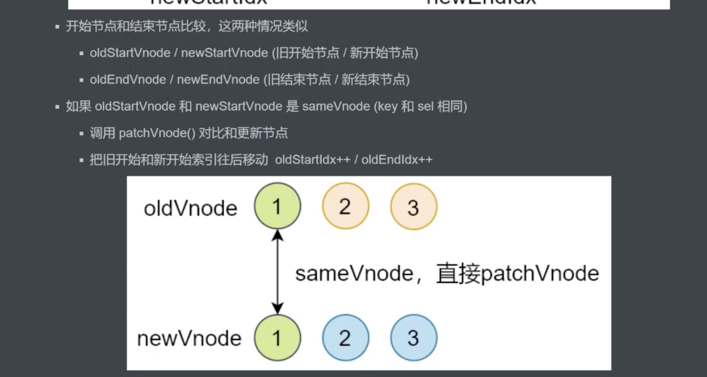
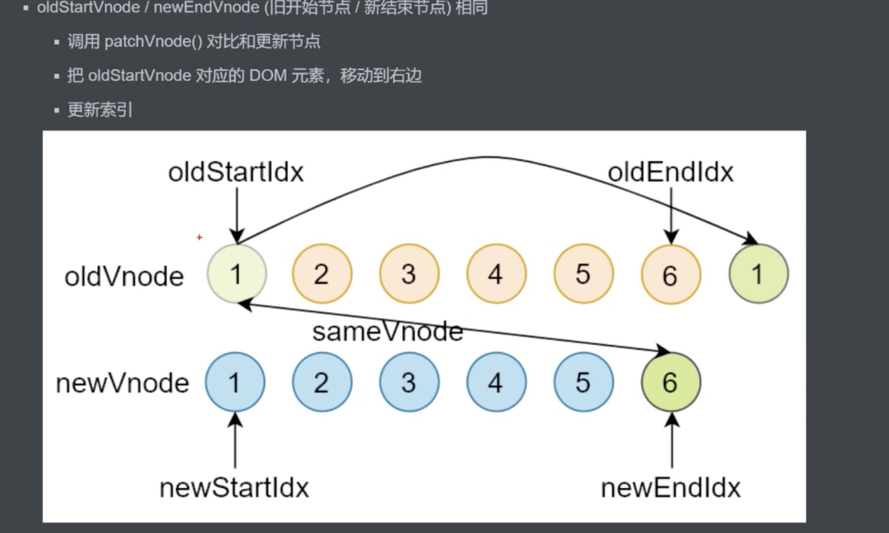
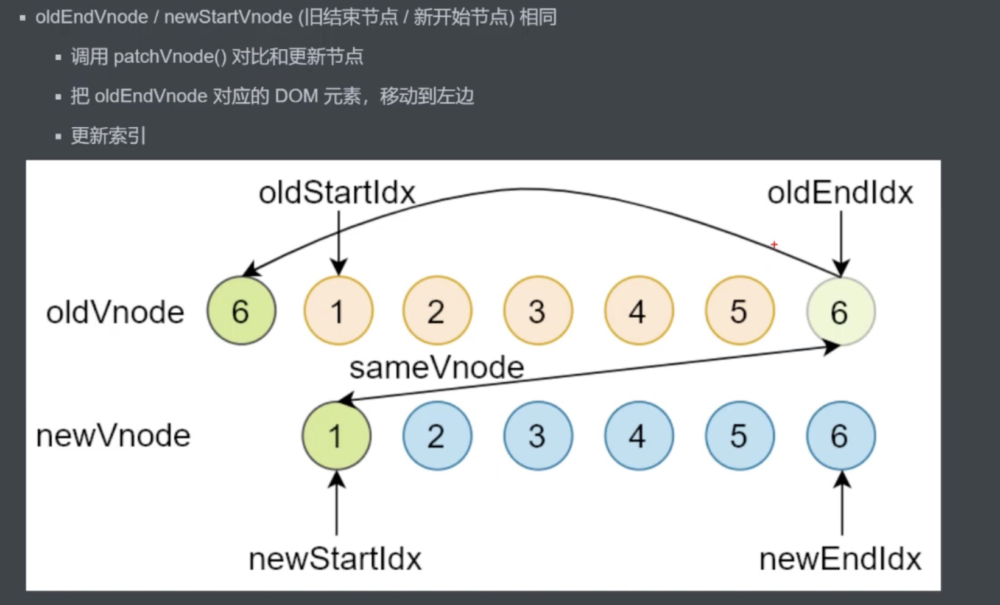
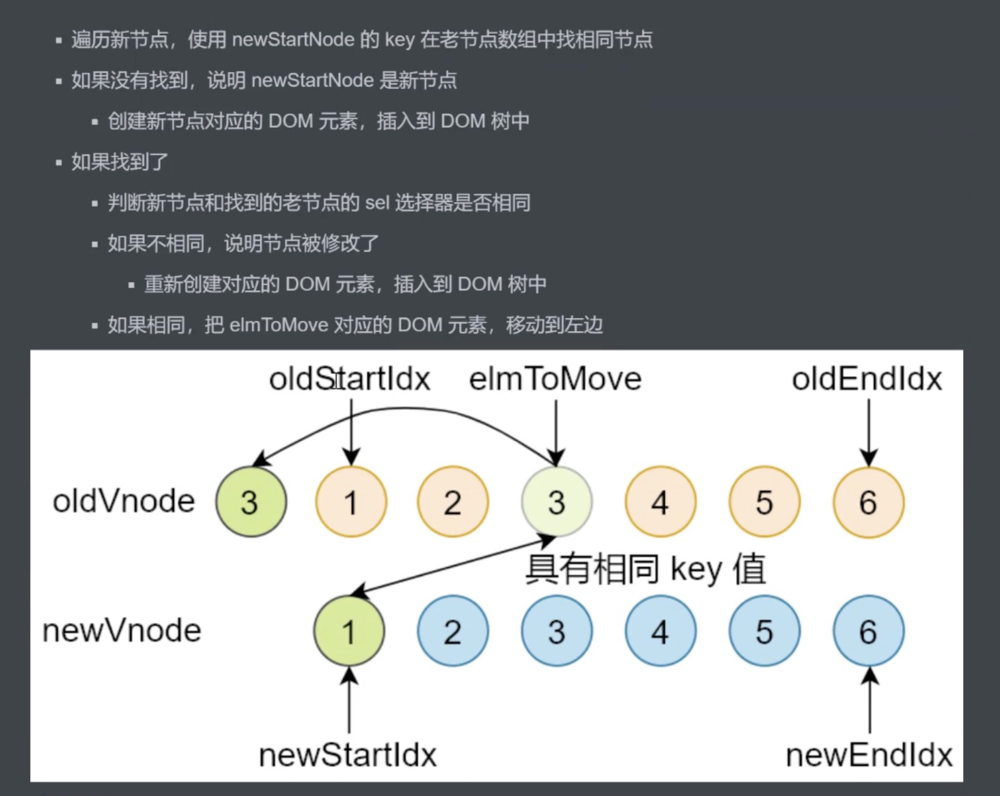
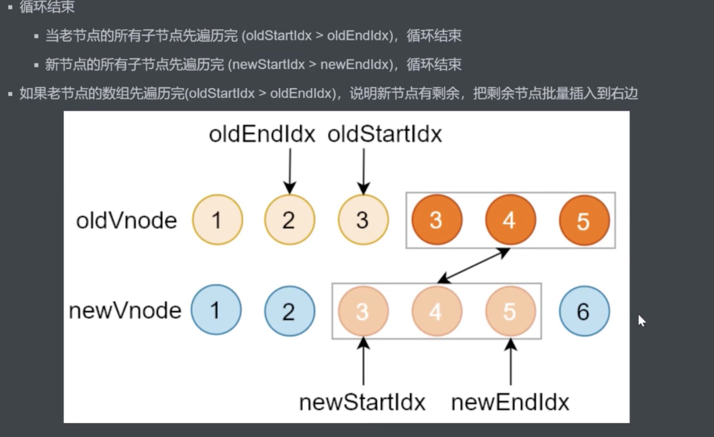
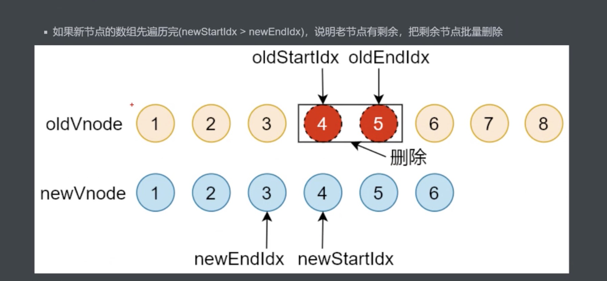
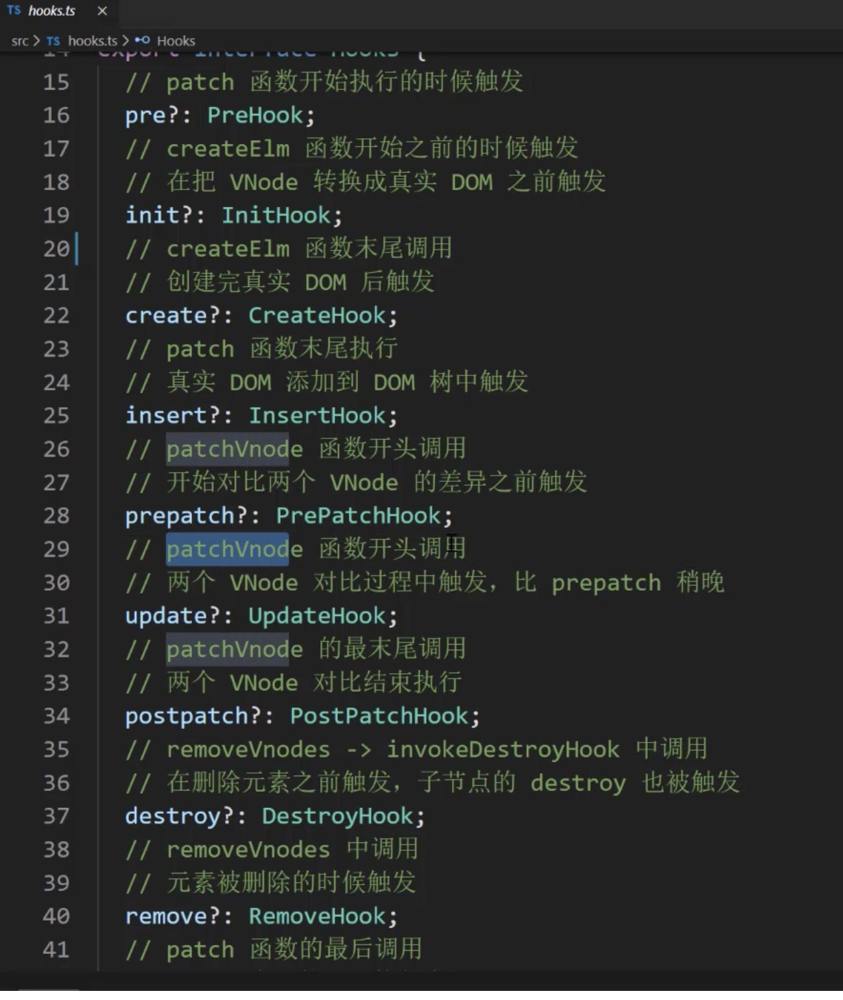

练习：https://github.com/Dream-Life/front-end/tree/master/vue-sty

# Vue-Router

1. Vue-router 的history 模式就是浏览器的history API

   - 浏览器history.pushState() || .replaceState()，加载页面
   - Vue-router的history.push()---加载页面可以后退
   - Vue-router的history.replace()---加载页面不可以后退，只是替换了url

2. hash和history的区别

   - history 模式就是浏览器的history API，浏览器history.pushState() || .replaceState()，加载页面；history.pushState() 在ie10之后支持
   - hash基于锚点和onchange事件，当url改变，出发onchange事件
   - 表现形式不同，hash带#，而且参数需要用?id=ddd来传递；history直接在最后加/[参数]就可以了

3. history在nodejs中

   - ```javascript
     const http = require('http')
     const express = require('express')
     const history = require('connect-history-api-fallback')
     
     let app = express()
     // history
     app.use(history())
     
     app.use(express.static('www'))
     
     app.listen(8888, ()=>{
         console.log('Serve is running at http://localhost:8888')
     })
     ```

   - 当没有加app.use(history())，页面路由刷新会404；加了后页面路由刷新首先会判断url是否存在，不是默认的index.html主页面所以不存在，就会直接加载单页面index.html，之后再次判断路由，vue-router中有的话，就会加载

4. History 在nginx上的配置，不然会出现nodejs里的刷新错误

   Nginx 上配置,配置好重启

   ```javascript
    location / {
               root   html;
               index  index.html index.htm;
      					# history配置
               try_files $url $url/ /index.html /index.htm
           }
   
   ```

5. Vue-cli 使用的是运行时的vue，比起完整版的vue，运行时的vue效率比较高

6. 完整版的vue包括编译器和运行时

7. vue版本的差别

   - 运行时的vue不支持template，需要在打包前提前编译
   - 完整版vue包括编译器和运行时，体积比运行大10KB左右，程序运行时版template编译成render函数

8. vue的install,是Vue.use(), 下面是自己写的vue-router

   ```javascript
   let _Vue = null
   export default class VueRouter {
     /*
   // 1. 添加全局方法或属性
     Vue.myGlobalMethod = function () {
       // 逻辑...
     }
   
     // 2. 添加全局资源
     Vue.directive('my-directive', {
       bind (el, binding, vnode, oldVnode) {
         // 逻辑...
       }
       ...
     })
   
     // 3. 注入组件
     Vue.mixin({
       created: function () {
         // 逻辑...
       }
       ...
     })
   
     // 4. 添加实例方法
     Vue.prototype.$myMethod = function (methodOptions) {
       // 逻辑...
     }
     */
   
     // 静态方法 安装vue-router
     static install (Vue) {
       // 1. 判断当前插件是否被安装
       if (VueRouter.install.installed) {
         return
       }
       VueRouter.install.installed = true
       // 2. 把Vue构造函数记录到全局变量
       _Vue = Vue
       // 3. 把创建Vue实例时候传入的router对象注入到Vue实例上
       // _Vue.prototype.$router = this.$options.router
       // 混入
       _Vue.mixin({
         beforeCreate () {
           if (this.$options.router) {
             _Vue.prototype.$router = this.$options.router
             this.$options.router.init()
           }
         }
       })
     }
   
     // 构造方法
     constructor (options) {
       this.options = options
       this.routerMap = {}
       // _Vue.observable vue用来创建响应式的对象,data数据变了会出发界面渲染
       this.data = _Vue.observable({
         current: '/'
       })
     }
   
     // 将this.options中的router转化为键值对象，并存储到routerMap
     createRouterMap () {
       this.options.routes.forEach(route => {
         this.routerMap[route.path] = route.component
       })
     }
   
     initComponents (Vue) {
       Vue.component('router-link', {
         props: {
           to: String
         },
         render (h) {
           return h('a', {
             attrs: {
               href: this.to
             },
             on: {
               click: this.clickHandler
             }
           }, [this.$slots.default])
         },
         methods: {
           // click事件是为了解决“a标签的页面刷新跳转的行为”和“'router-view'内容变化”
           clickHandler (e) {
             history.pushState({}, '', this.to)
             this.$router.data.current = this.to
             // 阻止事件的默认动作,这里的默认行为就是a标签的页面刷新跳转的行为
             e.preventDefault()
           }
         }
       //   template: '<a :href="to"><slot></slot></a>'
       })
   
       const self = this
       Vue.component('router-view', {
         render (h) {
           const compontent = self.routerMap[self.data.current]
           return h(compontent)
         }
       })
     }
   
      init () {
       this.createRouterMap()
       this.initComponents(_Vue)
       this.initEvent()
     }
   
     // 解决浏览器前进后退时，url变了，但router-view里的内容不变
     initEvent () {
       window.addEventListener('popstate', () => {
         this.data.current = window.location.pathname
       })
     }
   }
   
   ```

   

10.  router-link 组件的 active-class 和 exact-active-class 属性

    - exact-active-class 用来设置路由地址精确匹配的元素的样式

10. router-link 默认情况下的路由是模糊匹配，例如当前路径是 /article/1 那么也会激活 <router-link to="/article">，所以当设置 exact-active-class 以后，这个 router-link 只有在当前路由被全包含匹配时才会被激活 exact-active-class 中的 class

    ```html
    <router-link to="/article" active-class="router-active"></router-link>
    ```

    当用户访问 /article/1 时会被激活为：

    ```html
    <a href="#/article" class="router-active" rel="nofollow"></a>
    ```

    而当使用：

    ```html
    <router-link to="/article" exact-active-class="router-active"></router-link>
    ```

    当用户访问 /article/1 时，不会激活这个 link 的 class：

    ```html
    <a href="#/article" rel="nofollow"></a>
    ```


# vue响应式

1. Vue 数据响应式，双向绑定，数据驱动
2. 发布订阅模式和观察者模式的区别
   - 发布订阅模式：发布者在事件中心注册事件，订阅者获取事件中心中的事件，执行；两者之间隔着时间中心，不依赖
   - 观察者模式：订阅者将事件存储在发布者中，发布者可以直接执行订阅者的事件；两者关系依赖比较深
3. Vue主要结构$options, $el, $data, _proxyData()
4. 判断是文件节点还是元素节点
   - node.nodeType === 3 文件节点
   - node.nodeType === 1 元素节点
5. vue class (Vue,Observe,Watcher,Dep,Complier)

# 虚拟DOM

1. Snabbdom

   - Import {init,h,chunk} from 'snabbdom'
   - let patch = init([])
   - patch([dom],vnode) // 比较替换dom

2. Snabbdom Module

   - Import style from 'snabbdom/modules/style'
   - let patch = init([style])

3. 函数重载

4. h函数: 返回一个vnode虚拟dom节点

5. vnode: 虚拟dom节点

6. snabbdom patch

   

7. createElm

   

8. addVnode,removeVnode

9. patchVnode

   

10. updateChildren

    

    

    

    

    

    

11. key

12. hooks

    